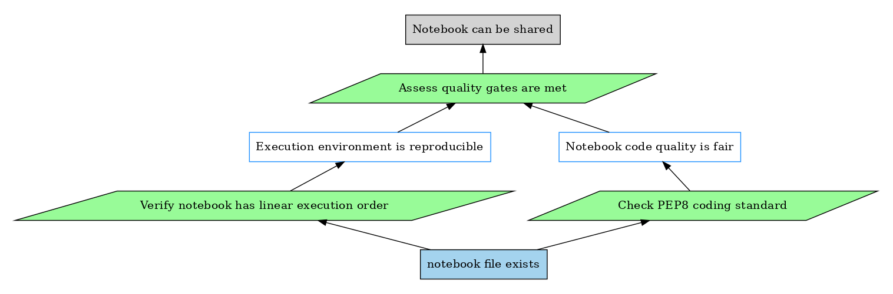

# jpipe-runner-test

## Command to Execute

```sh
jpipe-runner -l 'steps.py' --config-file 'config.yaml' 'justification.jd.json' --format svg -o .
```

## Expected Output

```
==============================================================================
jPipe Files
==============================================================================
jPipe Files.Justification :: notebook_quality
==============================================================================
evidence<notebook> :: notebook file exists                            | PASS |
------------------------------------------------------------------------------
strategy<linear> :: Verify notebook has linear execution order        | PASS |
------------------------------------------------------------------------------
strategy<pep8> :: Check PEP8 coding standard                          | PASS |
------------------------------------------------------------------------------
sub-conclusion<repro> :: Execution environment is reproducible        | PASS |
------------------------------------------------------------------------------
sub-conclusion<fair> :: Notebook code quality is fair                 | PASS |
------------------------------------------------------------------------------
strategy<gate> :: Assess quality gates are met                        | PASS |
------------------------------------------------------------------------------
conclusion<shareable> :: Notebook can be shared                       | PASS |
------------------------------------------------------------------------------
jPipe Files
1 justification, 7 passed, 0 failed, 0 skipped
==============================================================================
png diagram saved to: diagram.png
```

## Expected Diagram

